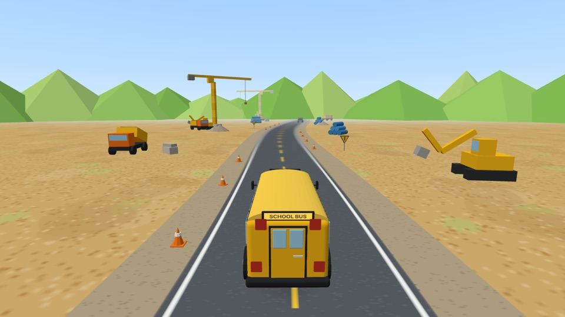
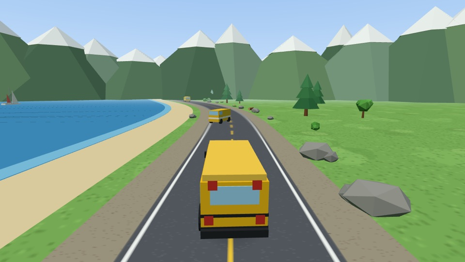
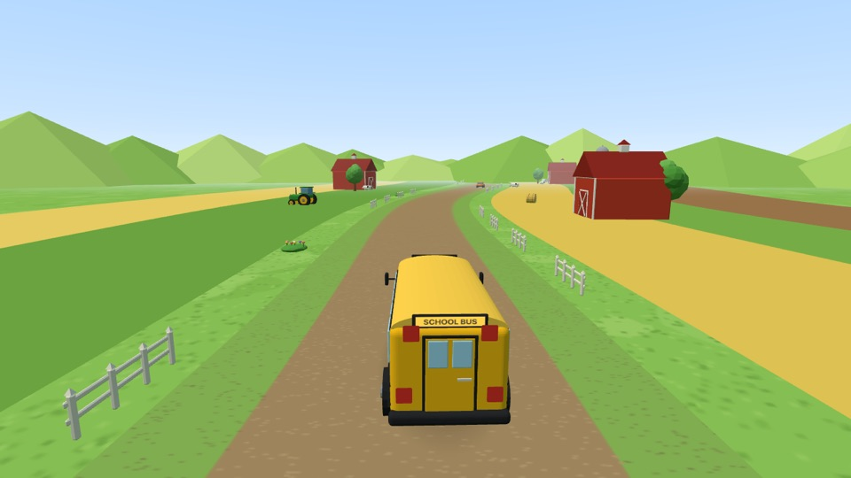
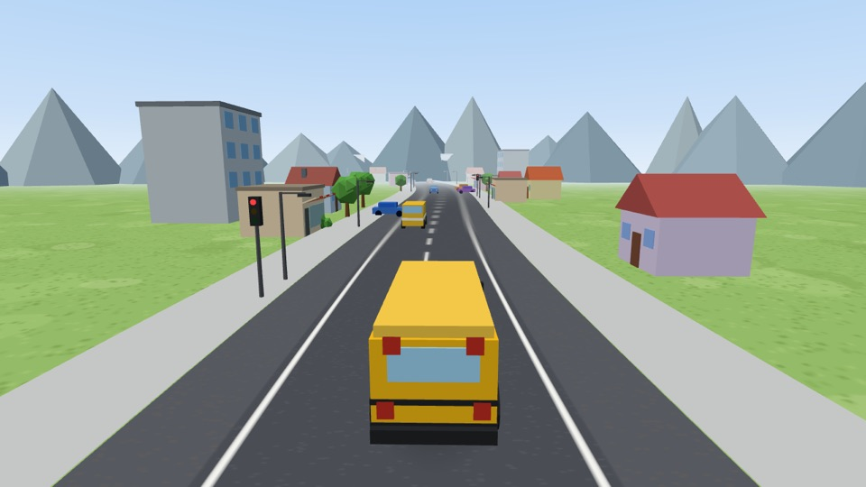
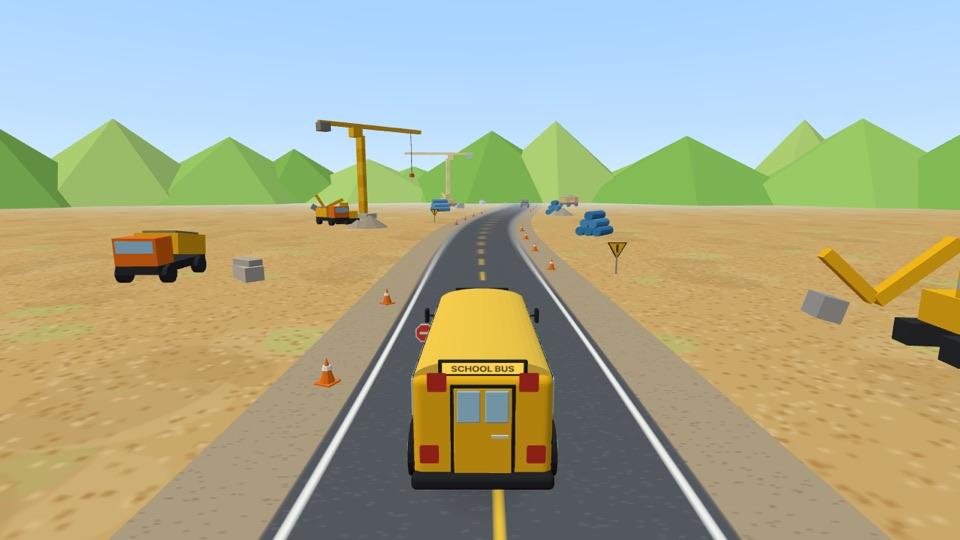
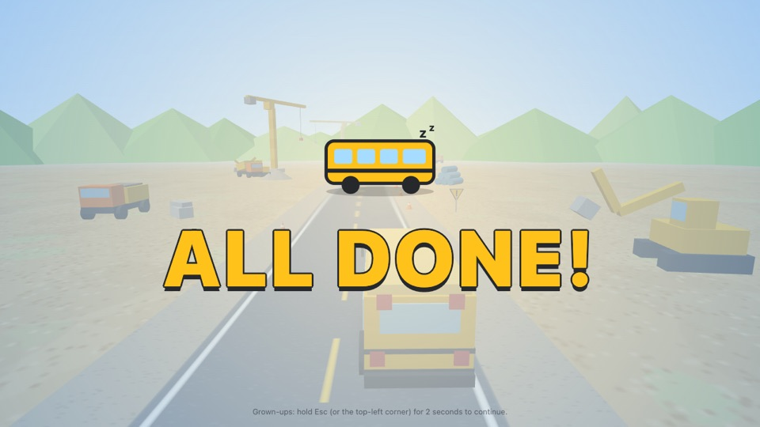
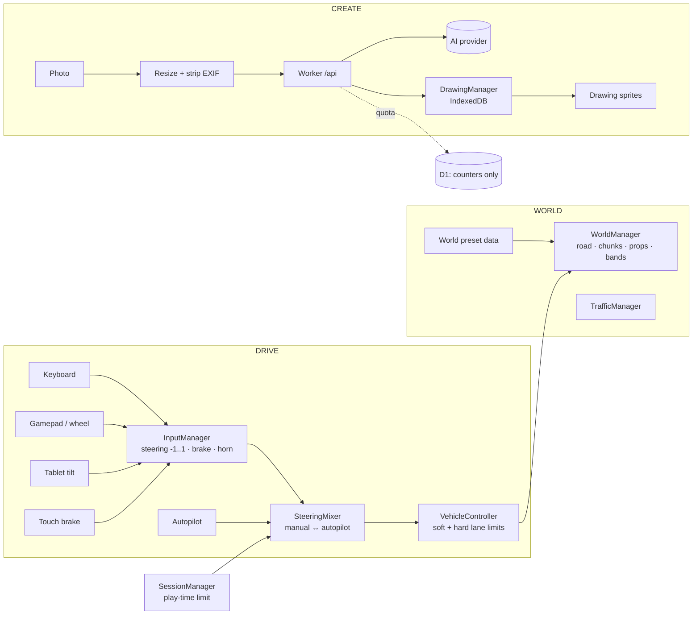

# Leo Racer

> **A little driving world for little drivers.**
> Drive. Draw. Watch your world come alive.

> ⚠️ **Alpha.** Leo Racer is being tested with a few families. Expect rough edges.

Leo Racer is a browser driving toy for children aged 2–4.

- **Always moving:** the yellow school bus is always driving.
- **Instant control:** the child takes the wheel at any moment, with keyboard, a real steering wheel, or a tablet tilted like a wheel.
- **Can't fail:** there are no crashes, no game over and no way off the road.
- **Autopilot:** when the child lets go, autopilot gently takes over again.
- **Drawings:** parents can photograph a child's drawing, and it shows up in the world, standing by the road or driving along it.

**Works with a keyboard or a real steering wheel. No hardware required.**

| Construction | Nature |
| --- | --- |
|  |  |
| **Farm** | **City** |
|  |  |

| Brake: the tail lights flash | Gentle end of a timed session |
| --- | --- |
|  |  |

## Features

- **Four worlds:** Construction, Nature, Farm and City. All are endless and pure data presets on one engine. Props are animated: cranes turn, windmills spin, traffic lights cycle.
  Nature has the sea, snowy mountains and now and then a gondola gliding up a mountainside.
  City is Vancouver-inspired: glass towers, the seawall, SkyTrain overhead, cherry blossoms and simplified landmarks.
- **Many inputs:**
  - Keyboard steering, brake and horn.
  - Any gamepad or steering wheel via the Gamepad API, with a calibration wizard.
  - Tablet tilt steering.
  - A big touch brake zone at the bottom of the screen.
- **Manual ↔ autopilot:** any steering takes over instantly. Autopilot blends back in after 8 s idle. There are no visible modes.
- **Built-in traffic:** cars, trucks, tractors and buses drive in their lanes and make way for the school bus. Parents set the density: Off, Low, Normal or Busy.
  - **Police:** a police SUV with a red/blue light bar flashing at 1.5 Hz (below the 3 Hz photosensitivity limit) drives in Nature and City.
  - **Sports car:** an 80s wedge supercar zooms past the bus on the Nature highway and drives calmly in City.
- **Draw Your World:** the photo is resized and its metadata stripped on the device. AI then cleans the drawing and suggests MOVES or STAYS, and a parent can override that.
  - A drawing that STAYS stands by the road.
  - A drawing that MOVES drives in a lane or alongside the road.
  - Each drawing has a frequency: Rare, Normal or Often.
- **Play-time limit:** Unlimited, or 5, 10, 15, 20 or 30 min. At the limit, the bus pulls over and stops softly, the engine fades, and the screen says "ALL DONE!". Only a parent can start another session.
- **Parent Menu:** hold `Esc` for 2 s or long-press the top-left corner. It has drawings, wheel calibration, tilt, play time, traffic, world, sound, fullscreen, diagnostics with export, and the privacy note.
- **Local-only diagnostics:** nothing is sent anywhere.

## Controls

| Who    | Action                         | Keyboard            | Wheel / gamepad   | Tablet                          |
| ------ | ------------------------------ | ------------------- | ----------------- | ------------------------------- |
| Child  | Steer                          | `←` `→` / `A` `D`   | Steering axis     | Tilt the tablet like a wheel    |
| Child  | Brake (hold; release to go on) | `↓` / `S`           | —                 | Press the bottom of the screen  |
| Child  | Horn                           | `Space` / `H`       | Any button        | —                               |
| Parent | Parent Menu                    | Hold `Esc` 2 s      | —                 | Long-press the top-left corner  |

## Browser support and tested hardware

- **Browsers:** current Chrome, Edge, Firefox and Safari, desktop and tablet. WebGL is required.
- **Primary device:** Surface Book 3 with a Chromium-based browser.
- **Steering wheel:** tested with a **Logitech MOMO Racing**. Other wheels and gamepads work through the generic Gamepad API plus calibration. See [docs/hardware-testing.md](docs/hardware-testing.md).
- **Tablet tilt:** uses the DeviceOrientation API. iOS asks for motion permission when START is pressed.

## Quick start

Requires **Node.js 22.13+** (24 LTS recommended; see `.nvmrc`).

```bash
npm install
npm run db:migrate:local    # once: local D1 tables for AI quota
npm run dev                 # http://localhost:5173
```

Local development uses the **mock** AI provider. It returns the image unchanged with a pseudo-random MOVES/STAYS guess, and needs no API key and no access code.
To try a real provider, copy `.dev.vars.example` to `.dev.vars` and fill it in.
In dev mode, `?debug` shows the diagnostics overlay.

| Script               | What it does                                           |
| -------------------- | ------------------------------------------------------ |
| `npm run dev`        | Vite dev server with the Worker running locally (Cloudflare Vite plugin) |
| `npm run build`      | Typecheck + production build                           |
| `npm run preview`    | Build and preview the production bundle locally        |
| `npm run typecheck`  | `tsc -b` for app, worker and tooling                   |
| `npm run lint`       | ESLint                                                 |
| `npm run test`       | Vitest unit tests                                      |
| `npm run test:e2e`   | Playwright browser tests (run `npx playwright install chromium` once) |
| `npm run deploy`     | Build and `wrangler deploy`                            |

## Architecture



The game core is fully client-side. If the network, the AI service or D1 fails, driving keeps working.
Details: [docs/architecture.md](docs/architecture.md) · [docs/ai-processing.md](docs/ai-processing.md).

## Privacy

There are no accounts, analytics, ads or child data.
- **Drawings** are stored only in the browser (IndexedDB).
- **AI processing:** the endpoint receives a resized, metadata-free copy of a drawing, passes it to the AI provider, and returns the result without storing it.
- **D1** stores only anonymous usage counters, which enforce the per-install monthly quota, a global daily cap and a per-minute rate limit.

## Deploying to Cloudflare (alpha)

1. Create the D1 database and copy the printed `database_id` into [wrangler.jsonc](wrangler.jsonc):
   ```bash
   npx wrangler d1 create leo-racer-alpha
   npm run db:migrate:remote
   ```
2. Set secrets. They are Worker-side only and never go in `VITE_*` variables:
   ```bash
   npx wrangler secret put ALPHA_ACCESS_TOKEN   # shared code for alpha testers
   npx wrangler secret put AI_API_KEY           # only when AI_PROVIDER=openai
   ```
   Plain vars in `wrangler.jsonc`: `AI_PROVIDER`, `AI_MONTHLY_LIMIT`, `AI_GLOBAL_DAILY_LIMIT`, `AI_RATE_LIMIT_PER_MINUTE`.
3. Connect the GitHub repo in **Cloudflare dashboard → Workers & Pages → leo-racer-alpha → Settings → Builds**:
   - Build command: `npm run build`
   - Deploy command: `npx wrangler deploy`
   - Non-production branch deploy command: `npx wrangler versions upload`. This gives each PR a preview URL.

After that, merging to `main` builds and deploys automatically.
[CI](.github/workflows/ci.yml) runs typecheck, lint and unit tests on every PR. Browser tests run on `main` and are not blocking yet.

## Testing with families

See [docs/family-testing.md](docs/family-testing.md) for what to observe and how to share diagnostics without personal data.

## Roadmap

The next steps are tracked in [leo-racer-post-mvp-roadmap.md](leo-racer-post-mvp-roadmap.md).
After that come Color Your Vehicle (printable templates), more animation and weather. Phone-to-TV drawing upload comes only once families use drawings regularly.

## License

There is no open-source license yet: all rights reserved.
Third-party components are listed in [THIRD_PARTY_NOTICES.md](THIRD_PARTY_NOTICES.md). All 3D models, textures and sounds are original and procedurally generated.
